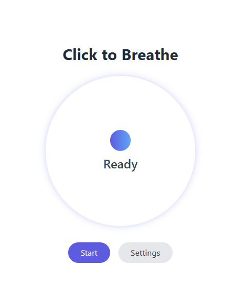

# Click to Breathe 🌸

A beautiful, browser-based meditation companion that transforms any browser into an instant tool for mindfulness and relaxation.

    

## ✨ Features

- **Dynamic Gradient Animations**: Beautiful color transitions that sync with your breathing rhythm
- **Visual Focus Element**: A floating orb that expands and contracts to guide your breath
- **Customizable Breathing Patterns**: Adjust inhale, hold, and exhale durations (2-10 seconds)
- **Multiple Session Durations**: Choose from 1 minute to 30 minutes, or continuous sessions
- **Dark Mode Support**: Automatically adapts to your system's color scheme
- **Responsive Design**: Works perfectly on desktop, tablet, and mobile devices
- **No Installation Required**: Works instantly in any modern web browser
- **Privacy Focused**: No data collection, tracking, or account required

## 🚀 Try It Now

**[Launch Click to Breathe →](https://naomiwolfe.github.io/click-to-breathe)**

## 🎯 How to Use

1. **Visit the app** in your web browser
2. **Click "Start"** to begin with default settings (4s inhale, 4s hold, 6s exhale)
3. **Focus on the center circle** and breathing orb as they guide your rhythm
4. **Customize your experience** by clicking "Settings" to adjust:
   - Breathing pattern timing
   - Session duration
   - Choose continuous mode for open-ended sessions
5. **Follow the prompts**: "Inhale", "Hold", "Exhale"
6. **Enjoy the calming gradient transitions** that change with each breath cycle

## 🎨 Visual Experience

- **5 Color Palettes**: Blue, Green, Orange, Purple, and Teal gradients
- **Smooth Animations**: CSS transitions with natural cubic-bezier timing
- **Floating Focus Element**: Subtle animations help maintain concentration
- **Responsive Scaling**: Circle expands up to 25% larger during inhale phases

## 🛠️ Built With

- **HTML5** - Semantic structure
- **CSS3** - Advanced animations and gradients
- **Vanilla JavaScript** - Core functionality and breathing logic
- **Tailwind CSS** - Responsive design and styling
- **GitHub Pages** - Free hosting and deployment

## 📱 Browser Compatibility

Works on all modern browsers including:
- Chrome 70+
- Firefox 65+
- Safari 12+
- Edge 79+

## 🤝 Contributing

Contributions are welcome! Feel free to:
- Report bugs or issues
- Suggest new features
- Submit pull requests
- Share feedback

## 📄 License

This project is licensed under the MIT License - see the [LICENSE](LICENSE) file for details.

## 🙏 Acknowledgments

- Inspired by meditation and mindfulness practices
- Color palettes designed for visual comfort and relaxation
- Built with accessibility and user experience in mind

---

**Take a moment. Just breathe.** 🌸
